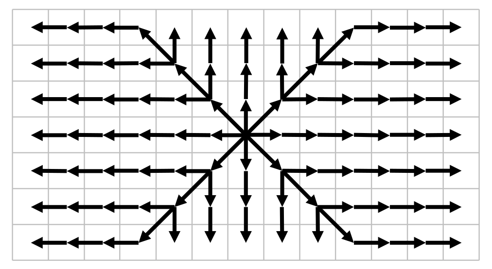
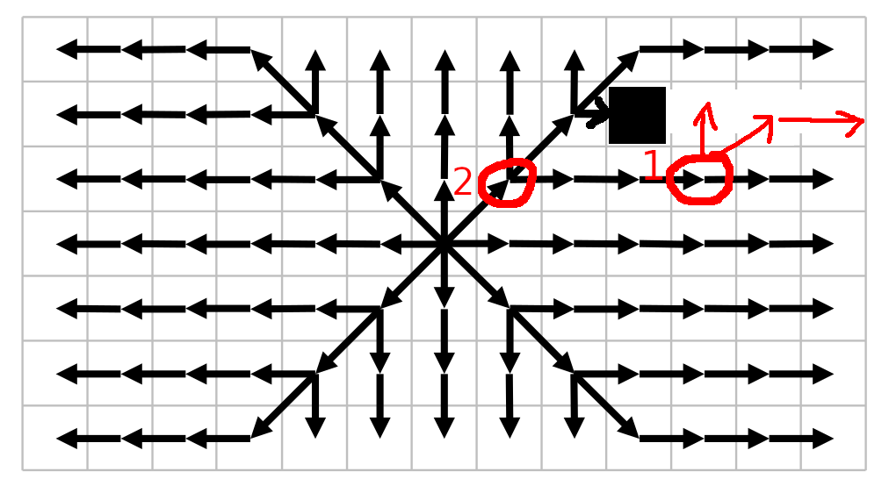

# Program & algorithm structure

### Program structure
Rendering, user input and other UI-related functionality is located in the top-level [src](../src/) directory.

Actual pathfinding logic is located in the [algorithms](../src/algorithms/) subfolder. This document will focus on that logic.

* The [State](../src/state.hpp) module functions as the link between these two systems. It is the only top-level module referenced in the pathfinding modules, and contains definitions about the state of the pathfinding map.
A pointer to a State structure is passed to the algorithms, which they then subsequently modify to show the results of the pathfinding to the user.

* The [Util](../src/algorithms/util.hpp) module contains utility functions for all the algorithms to use.
These include, for example, functions to get all neighbours of a particular node in the map, heuristic functions, and definitions of directions.

* The [Algorithm](../src/algorithms/algorithm.hpp) module defines the abstract base class from which all algorithms inherit. It is the interface algorithms should adhere to in order to be usable in the program.

* The [Common](../src/algorithms/common.hpp) module defines a base class (inheriting from Algorithm) for the A* and JPS algorithms. This base class contains definitions, as the name suggests, common for both of the algorithms.

* The [AStar](../src/algorithms/a_star.hpp) and [JumpPointSearch](../src/algorithms/jps.hpp) modules contain the actual pathfinding algorithms. The rest of the document will focus on the technical and theoretical bases of these algorithms.

### Algorithms

#### A*
A* is a network pathfinding algorithm that uses both the distance from the starting node and a heuristic function approximating the distance to the goal node. In this manner, it is a direct improvement on the more well-known Dijkstra's algorithm. In the following paragraphs, I will highlight this difference by comparing these algorithms directly.

Like Dijkstra's algorithm, A* maintains a sorted priority queue of nodes to explore next. The next node to look at and expand is picked from the front of the priority queue.

In Dijkstra's algorithm, the priority queue is sorted using the function `g(x)`, denoting the distance of node `x` from the starting node. This way Dijkstra's algorithm guarantees optimality: if it only selects the node closest to the start, when it eventually expands the goal node, all nodes after it are guaranteed to be either equally far away or even farther away from the start, so their distance would be even greater. Thus the shortest path is found.

A* works on the same principles, but instead of sorting the priority queue using `g(x)`, it sorts the priority queue using the sum of `g(x) + h(x)` where `h(x)` is a heuristic function estimating the distance from node `x` to the goal node. This way A* can find a path to the goal node quicker by also prioritizing an estimated distance to the goal. If this estimation is never greater than the actual distance, A* is guaranteed to find the optimal path.
In the present project, this is done by using euclidian distance as the heuristic: this is guaranteed to be smaller or equal to the shortest path.

In short, in each loop iteration, A* examines and pops the "best" node (judged by `g(x) + h(x)`) from its priority queue, checks if shorter paths (than previously encountered) to its neighbours can be achieved through this node, and adds those shorter paths with their heuristic to the priority queue. When A* encounters the goal node, the shortest path has been found.

#### JPS
Jump Point Search (JPS) is a search-space pruning algorithm that can, and needs to, be combined with any pathfinding algorithm. In the present project, JPS was combined with the aforementioned A* algorithm.

JPS improves and speeds up "pure" A* in several ways.

First of all, A* explores the same nodes multiple times very frequently. In fact, every time a new node is added and then later expanded from the priority queue, A* will calculate new distances to all of its neighbours and compare them with the already-existing distances: this means that at minimum one check is redundant (the check of the neighbour from which this node is descendant), often times even more. Over its execution, A* ends up calculating the distances to same, symmetric paths over and over again.

JPS eliminates this repetition: it expands around the examined node in a systematic manner, where no node is accessed twice needlessly. Here is a graph that shows how JPS expands its search from the node in the centre:

*Image taken from source [3].*

The contrast to A*'s "every node explores all of its neighbours individually" is clear from the picture. According to Rabin and Silva [reference 3], this contrast accounts for 50% of JPS's speed increases over pure A*.

The second big contrast to pure A* is in the frequency at which new nodes are added to and removed from the priority queue. Keeping and manipulating a large priority queue can impact the algorithm's performance significantly, as every access of the queue involves multiple operations and often times a O(log n) worst case time complexity.
Where A* adds every single neighbour with a new lower distance to the priority queue, JPS only adds special points.
These special points are called _jump points_, from which JPS gets its name.

Jump points are points in which the direction of the optimal path may change. There are two ways for a node to be a jump point:
1. The node has "forced neighbours", i.e. neighbouring nodes that will not be reached from the current scan of the map due to obstacles.
2. The path needs to change direction from the origin of the scan to reach a node of the above definion.

The image below (_taken from source [3], same as above but modified_) demonstrates these definitions:

The red circles are jump points due to the new obstacle (black square) introduced. The obstacle prevents the scan from advancing to nodes that the jump point with forced neighbours (1) can explore. In jump point number 2, the path from the centre changes to reach jump point number 1, therefore adhering to case 2.

Though in the original paper [2] both are regarded as nodes of equal importance, the jump points of type 2 (only diagonal nodes) need not even be added into the priority queue if the scan is continued past them, which doesn't happen in the original paper [2].
This is because all nodes reachable from them are already explored during the original complete scan.
As the picture shows, all nodes that a new scan from node 2 would explore are already explored with equal or smaller distance from the original node.
Therefore only jump nodes of type 1 need to be added to the priority queue.

In any case, this significant reduction in priority queue modifications in large areas accounts for the other 50% speed increase JPS has over pure A* according to [3].

Thanks to these optimizations, in my benchmarks for the scenario file for the Starcraft 1 map "Aftershock", A* combined with JPS pruning was on average over 60% faster than pure A* for distances greater than 200. For distances smaller than 200, however, it was on average 9% slower. This is because over smaller distances, JPS still scans over all the possible nodes, which will take more time than adding a couple of nodes in the direction of the goal node in the priority queue as pure A* does.

More detailed benchmarks can be found in [testing_and_benchmarking.md](./testing_and_benchmarks.md).

### 4-way pathing instead of 8-way pathing
The previous images and the algorithms implemented for the project assume that each node has 8 neighbours, i.e. that diagonal movement is allowed. However, in the present project diagonal movement is not allowed for nodes that have neighbouring walls in either component direction of the diagonal (so entities using the pathing are assumed to have greater than 0 size).

If a path needs to be created for agents that can only travel in cardinal directions, it can first be generated using a 8-way system like in the project, and then each diagonal movement can be converted into 2 movements of its component directions. For example, a movement towards northeast can be converted into a movement towards north followed by a movement towards east.

### Sources & references
1. [A* search algorithm (Wikipedia)](https://en.wikipedia.org/wiki/A*_search_algorithm)
2. "Online Graph Pruning for Pathfinding on Grid Maps", Harabor and Grastien, 2011
3. \[Game AI Pro 2\] "JPS+: An Extreme A* Speed Optimization for Static Uniform Cost Grids", Rabin and Silva, 2015

### Testing and benchmarking
For information on testing and benchmarking, see [testing_and_benchmarking.md](./testing_and_benchmarks.md).

### About the usage of large language models (for the University of Helsinki course)
Laajoja kielimalleja ei ole käytetty työssä.