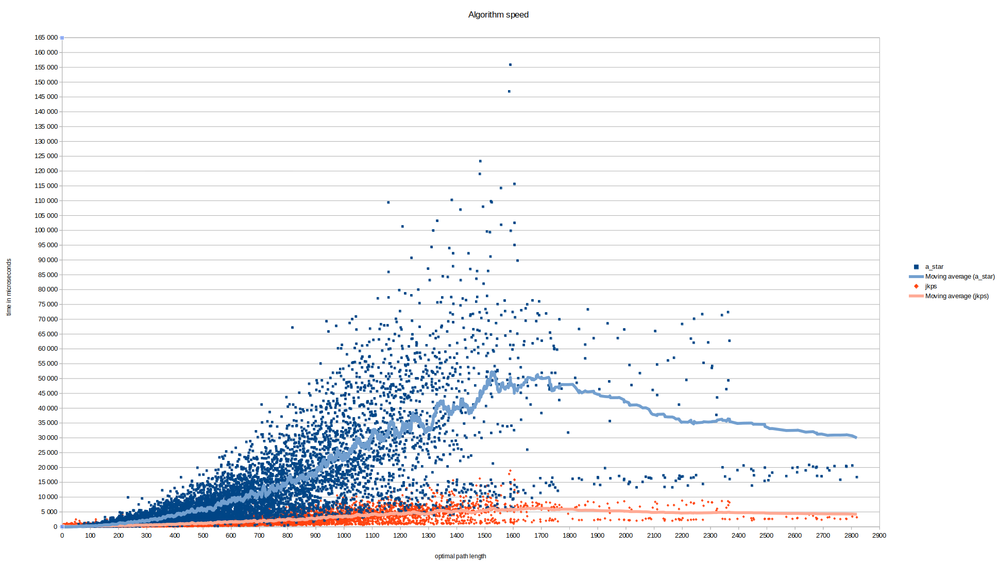
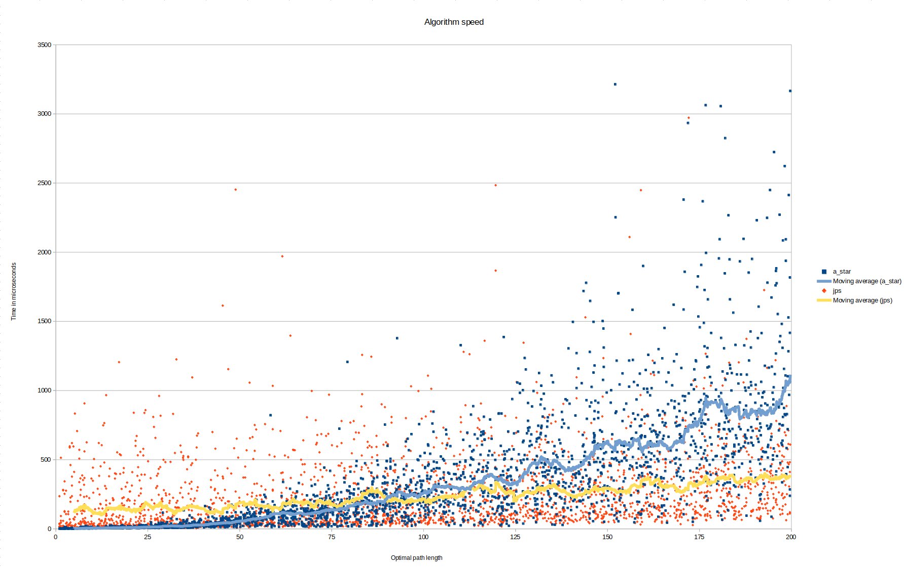

# Testing & benchmarks

The project uses [Catch2](https://github.com/catchorg/Catch2) for unit tests.
When building tests using the `tests` CMake preset, Catch2 is pulled from Github using CMake's FetchContent and compiled.

Instructions for building and running tests are in the main [README.md](../README.md) file.

## Unit tests

The following modules are unit tested extensively:
* [Util](../src/algorithms/util.hpp) ----> [test_util.cpp](../tests/test_util.cpp)

The individual tested items can be read from the `SECTION` names of the test files.

In addition to unit tests, the pathfinding algorithms have been verified to find the shortest path in several `.scen` files and 10 000 scenarios through benchmarking (which automatically checks that the found path and the optimal path match). Benchmarking is covered in the next section.

## Benchmarks
For running benchmarks, download maps (`.map`) and scenario files (`.scen`) from https://movingai.com/benchmarks/grids.html.
After placing them in any directory (for example in a "benchmarks" directory within the [tests](../tests/) directory), direct the tests executable to this directory by providing its path after `--benchmarks`.

Example:
```
build/tests --benchmarks tests/benchmarks
```
Unit tests will be skipped, and all the scenario files within that directory will be executed.
The output of the benchmarks is printed in standard output, in the following format with comma delimiters (CSV, suitable for importing to a spreadsheet application):

| map name (string) | scenario optimal length (float) | algo1 time (float, microseconds) | algo2 time | ... | |
| ------------- | ------------- | ------------- | ------------- | ------------- | ------------- |
| Aftershock.map | 3.82 | 123.10 | 67.51 | ... 

Running all the provided scenarios can take a really long time. To counter this, and to allow a more balanced and diverse set of maps and scenarios to be benchmarked, you can specify the amount of scenarios you want to benchmark by adding an additional command line parameter: `--amount`. The specified amount of scenarios will be sampled randomly from all the `.scen` files present in the directory. Example usage:
```
build/tests --benchmarks tests/benchmarks --amount 1000
```

If you want more fine-grained control after sampling the random scenarios, you can use the [scenario_scrambler.py](../tests/scenario_scrambler.py) tool.
The tool takes two command-line arguments: the directory from which to load the scenario files, and the total amount of scenarios outputted.
The scrambler will randomly select the wanted amount of scenarios from all the `.scen` files present in the provided directory, and print it to standard output, from which it can be directly piped to a new scenario file.

Example usage in a Bash shell:
```
python tests/scenario_scrambler.py tests/all_scenarios 1000 > tests/benchmarks/final.map.scen
```
This assumes that [Python](https://www.python.org/) is installed, that the command is executed from the project root directory, and that the `tests/all_scenarios` directory exists and is populated with `.scen` files.
After executing the command, the file `tests/benchmarks/final.map.scen` is populated with 1000 randomly selected scenarios from all the scenario files present in `tests/all_scenarios`.

### Graphs

The graph below is composed of 10 000 different scenarios selected by random from all the available Starcraft 1 and Dragon Age: Origins scenarios. 

The x-axis is the optimal path length and the y-axis is the time it took the specific algorithm to find this optimal path.



From the trend lines (moving average of 70 scenarios) we can see that JPS, on average, outpeforms A* in all distances over 150 or so.

In addition, where A* seems to increase its time requirements quite linearly (with the moving average going as far as 50ms), JPS seems to stabilize around the 5ms range after the 1000 optimal path length.
Time consistency is a desirable quality for a pathfinding algorithm.

Here is the same graph, but limited to the interesting 0–200 optimal path area:



From this graph, the point around 90 or so optimal length where JPS starts to outpeform A* on average is clearly visible.

Due to the existence of this point and the fact that JPS seems much more inconsistent at lower lengths, perhaps a hybrid approach switching the algorithms around such a length (determined by checking the octile distance without obstacles) could be optimal for pathfinding.

## Attributions

The program uses a modified version of the scenario and map loading functionalities of the [HOG2](https://github.com/nathansttt/hog2) project. Modification had to be done to remove dependencies on OpenGL and other parts of HOG2. These files are:
* [Map.h](../tests/hog2/Map.h)
* [Map.cpp](../tests/hog2/Map.cpp)
* [ScenarioLoader.h](../tests/hog2/ScenarioLoader.h)
* [ScenarioLoader.cpp](../tests/hog2/ScenarioLoader.cpp)

These files are used to load and process the `.map` and `.scen` files for benchmarking.